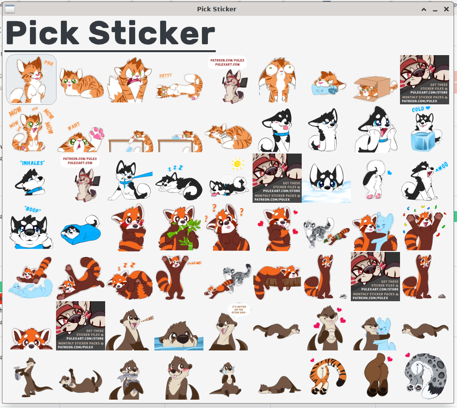

# pick-sticker

Specialied application for using sticker sets. Made with [Raylib](https://www.raylib.com)

Status: In development

## Preview



## Usage

```sh
git clone https://github.com/hyperupcall/pick-sticker
cd ./pick-sticker
bake collect
bake download
bake generate_sizes
make
```

## TODO

- Use [cosmopolitan](https://justine.lol/cosmopolitan)
