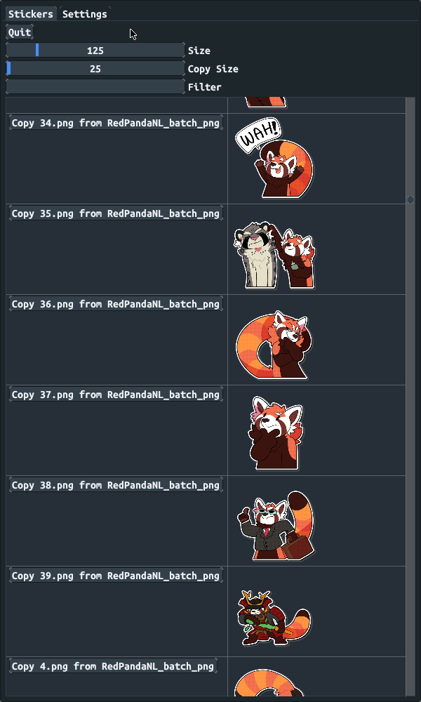

# sticker-selector

WIP cross-platform sticker selector using a [Go Port](https://github.com/AllenDang/giu) of Dear ImGui

For now, only works on linux and requires `xclip` and ImageMagick's `convert` tool in PATH. Hacky and broken. Docs TODO

## Preview

